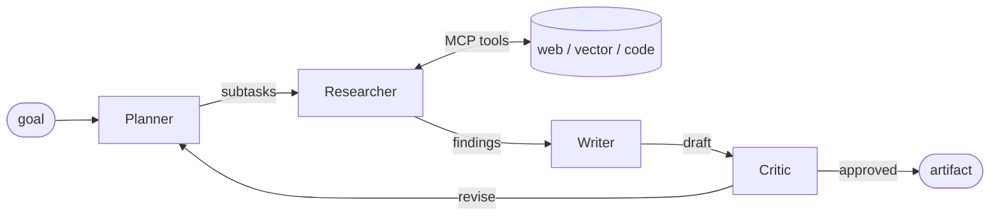

# Multi-Agent Reference Architecture

> A production-grade, **provider-agnostic** multi-agent system — Planner →
> Researcher → Writer → Critic — with MCP tools, OpenTelemetry tracing,
> pre/post guardrails, and an evaluation gate. It runs end-to-end **offline with
> zero credentials** (mock provider) and swaps in real LLM providers by config.
> Built as a reference for how agentic AI looks in production, not a demo.

<!-- Badges placeholder: CI · eval-gate · license · coverage -->

---

## Contents

- [Why this exists](#why-this-exists)
- [Highlights](#highlights)
- [Architecture](#architecture)
- [Prerequisites](#prerequisites)
- [Installation](#installation)
- [Usage](#usage)
- [Configuration](#configuration)
- [Project layout](#project-layout)
- [Testing](#testing)
- [Deployment](#deployment)
- [Troubleshooting](#troubleshooting)
- [What's real vs. pluggable](#whats-real-vs-pluggable)

## Why this exists

Most agent demos stop at a single happy path, one provider, and no
observability, safety, or evaluation. The hard parts of production agents —
vendor neutrality, tracing every LLM call, moderating inputs and outputs, and
gating releases on quality — are exactly what this repo demonstrates, with a
test suite to prove each piece works.

## Highlights

- **4-agent pipeline** with conditional routing (the Critic can send work back
  to the Planner, bounded by `max_revisions`) on **LangGraph**, with a typed
  `RunState`.
- **Switch LLM provider per agent with one env var** — `anthropic`, `bedrock`,
  `vertex`, `foundry`, or the offline `mock`. No vendor SDK is imported outside
  `providers/`.
- **Tools as MCP servers** (FastMCP, stdio + HTTP): `web_search`,
  `vector_retrieval`, `code_search`.
- **Guardrails on every LLM call** (pre + post) via a composable orchestrator.
- **OpenTelemetry span per run and per LLM call**, carrying model + token usage
  (export to any OTLP collector / Langfuse).
- **Eval gate**: keyword-coverage + LLM-as-Judge over a versioned golden set;
  a > 5% regression fails CI.

## Architecture



Design and decisions: [Architecture](docs/architecture.md) ·
[ADR-001 LangGraph vs AutoGen](docs/adr/001-langgraph-vs-autogen.md) ·
[ADR-002 MCP as the tool protocol](docs/adr/002-mcp-as-tool-protocol.md) ·
[ADR-003 Multi-provider strategy](docs/adr/003-multi-provider-strategy.md).

## Prerequisites

- **Python 3.12+** (`python --version`).
- That's all for the default offline run. Optional:
  - **Docker** — only for the `docker compose` dependency stack (Postgres,
    Redis, Langfuse).
  - Provider credentials — only if you switch an agent off the `mock` provider.

## Installation

```bash
git clone https://github.com/jeanmalaquias/multi-agent-reference.git
cd multi-agent-reference

python -m venv .venv
source .venv/bin/activate        # Windows: .venv\Scripts\activate

pip install -e ".[dev]"          # core + test/lint tooling
```

Optional extras:

| Extra | Installs | When you need it |
|-------|----------|------------------|
| `providers` | `anthropic[bedrock,vertex]`, `openai` | to use a real provider adapter |
| `mcp` | `mcp` | to run the tools as a standalone MCP server |

```bash
pip install -e ".[dev,providers,mcp]"   # everything
```

## Usage

### Run a goal through the pipeline (offline, no keys)

```bash
python -m magent.cli run "Write a one-page brief on pgvector" \
  --criterion accurate --criterion concise
```

Expected output (mock provider):

```
============================================================
GOAL: Write a one-page brief on pgvector
PLAN: ['Research the topic', 'Draft the artifact', 'Review quality']
FINDINGS: 3
------------------------------------------------------------
# Artifact
...
------------------------------------------------------------
CRITIC: APPROVED (score=0.9)
```

### Serve the API

```bash
uvicorn magent.api.main:app --port 8080
# GET  /healthz            -> {"status":"ok"}
# POST /run  {"goal": "...", "acceptance_criteria": ["accurate"]}
```

### Run the tools as a standalone MCP server

```bash
pip install -e ".[mcp]"
python -m magent.mcp_servers.server        # stdio; validate with MCP Inspector
```

### Run the eval gate

```bash
magent-eval run                  # exits non-zero on >5% regression vs baseline
magent-eval run --update-baseline
```

## Configuration

Configuration is environment-driven (prefix `MAGENT_`), loadable from a `.env`
file. Copy the example and edit:

```bash
cp .env.example .env
```

| Variable | Default | Purpose |
|----------|---------|---------|
| `MAGENT_PLANNER_PROVIDER` | `mock` | provider for the Planner |
| `MAGENT_RESEARCHER_PROVIDER` | `mock` | provider for the Researcher |
| `MAGENT_WRITER_PROVIDER` | `mock` | provider for the Writer |
| `MAGENT_CRITIC_PROVIDER` | `mock` | provider for the Critic |
| `MAGENT_MAX_REVISIONS` | `3` | Critic → Planner revision cap |

Valid providers: `mock`, `anthropic`, `bedrock`, `vertex`, `foundry`. Real
providers also need their SDK (the `providers` extra) and credentials
(`ANTHROPIC_API_KEY`, AWS/GCP/Azure config).

## Project layout

```
src/magent/
├── api/            # FastAPI gateway (/healthz, /run)
├── agents/         # planner, researcher, writer, critic
├── graph/          # LangGraph orchestrator + typed RunState
├── tools/          # MCP client + in-process tool registry
├── mcp_servers/    # FastMCP server: web_search, vector_retrieval, code_search
├── providers/      # anthropic, bedrock, vertex, foundry, mock, router
├── guardrails/     # orchestrator + heuristic backend (pluggable)
├── observability/  # OpenTelemetry tracing wrapper
├── eval/           # golden dataset, metrics, runner, magent-eval CLI
├── config/         # pydantic-settings
├── runtime.py      # resolve_provider = provider + guardrails + tracing
└── cli.py          # magent run
```

## Testing

```bash
pytest --cov --cov-report=term-missing    # 43 tests, 100% source coverage
ruff check .                              # lint
```

The whole suite is hermetic (mock provider + in-memory OTel exporter), so it
needs no network or credentials.

## Deployment

| Target | How |
|--------|-----|
| Local deps | `docker compose up -d` (Postgres/pgvector, Redis, Langfuse) |
| Container | `docker build -t multi-agent .` then run on port 8080 |
| Kubernetes | `helm install magent ./helm/multi-agent` |
| Azure | `az deployment group create -f infra/azure/main.bicep` (Container Apps) |
| AWS | `terraform -chdir=infra/aws apply` (ECS Fargate) |

## Troubleshooting

- **`Unknown provider '...'`** — set a valid `MAGENT_*_PROVIDER` (see
  Configuration); real providers require the `providers` extra.
- **MCP server import error** — install the `mcp` extra (`pip install -e ".[mcp]"`).
- **Eval gate fails locally** — you changed agent/prompt behavior; review the
  diff, then `magent-eval run --update-baseline` to accept the new baseline.

## What's real vs. pluggable

To stay hermetic and credential-free, the defaults are deterministic stand-ins;
each has a real backend behind the same interface:

| Piece | Default | Real backend (pluggable) |
|-------|---------|--------------------------|
| Provider | `mock` (deterministic) | Anthropic / Bedrock / Vertex / Foundry |
| Guardrail | heuristic (blocklist + injection patterns) | Llama Guard 3 / cloud content safety |
| Tools | in-process mock data | live web search / pgvector / code index |
| Tracing export | in-memory / OTLP | Langfuse or any OTLP collector |

## License

MIT (see [LICENSE](LICENSE)).
