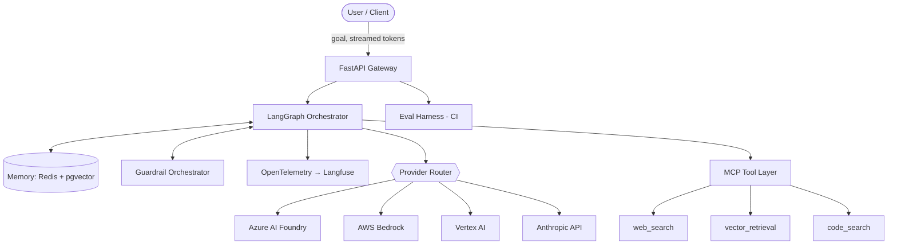
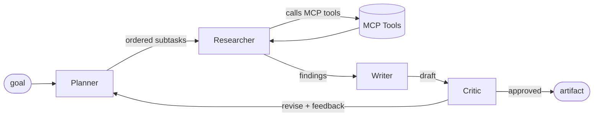

# Multi-Agent Reference Architecture — Design

> Status: **Draft for review** · Owner: Jean Malaquias · Last updated: 2026-06-16

This document is the authoritative design for a production-grade, multi-provider
multi-agent system. It is intended to read like an internal engineering design
doc, not a tutorial. Implementation must not begin until this document is
approved.

---

## 1. Problem statement

Teams adopting agentic AI repeatedly rebuild the same scaffolding: an
orchestration loop, a tool layer, provider abstraction, memory, guardrails, and
evaluation. Most reference implementations stop at a single happy-path demo with
one provider and no observability, eval, or safety story — which is exactly the
part that makes agents hard in production.

This project is a **reference architecture** that demonstrates the full
production surface of a multi-agent system, vendor-neutral across the three
major cloud LLM platforms, with first-class observability, guardrails, and
evaluation gating.

### Goals

1. A 4-agent pipeline (Planner → Researcher → Writer → Critic) that takes a
   high-level goal and produces a reviewed artifact.
2. Provider-agnostic agents: a single config flag switches the LLM provider per
   agent (Azure AI Foundry, AWS Bedrock, Vertex AI, Anthropic direct).
3. Tools exposed via Model Context Protocol (MCP), not bespoke function calling.
4. Every LLM call is wrapped by pre/post guardrails and emits an OpenTelemetry
   span carrying token usage and cost.
5. An evaluation harness that runs in CI and blocks merges on score regression.

### Non-goals

- A polished end-user product UI. The client surface is a thin API + streaming.
- Training or fine-tuning models. This is an orchestration and ops reference.
- Supporting every provider. Four is enough to prove the abstraction.

---

## 2. Quality attributes (non-functional requirements)

| Attribute | Target | How it is met |
|-----------|--------|---------------|
| Latency | First token < 2 s; medium run < 60 s | Streaming, semantic cache, parallel research fan-out |
| Cost | < $0.10 per medium task | Semantic caching of repeated sub-queries, cheap models for Planner/Critic |
| Scalability | Stateless agents, horizontal scale | No in-process state; checkpoints in Redis/Postgres |
| Reliability | Idempotent retries, DLQ for tool calls | Tenacity retries + dead-letter on the message bus |
| Observability | Full trace input→artifact, every LLM call | OpenTelemetry spans → Langfuse + OTLP collector |
| Security | OAuth2 on endpoints, secrets in a vault, no PII in logs | Pydantic redaction, Key Vault/Secrets Manager |
| Safety | Pre- and post-call moderation on every LLM call | Guardrail orchestrator (Llama Guard 3 + cloud content safety) |
| Quality | Eval gate on every release | Ragas + LLM-as-Judge, regression threshold in CI |

---

## 3. System context (C4 level 1)



## 4. Agent pipeline (C4 level 2)



- **Planner** decomposes the goal into an ordered list of subtasks. Uses a cheap
  model; its output is a typed plan, not free text.
- **Researcher** executes subtasks by selecting and calling MCP tools, writing
  findings to long-term memory.
- **Writer** synthesizes findings into the requested artifact.
- **Critic** scores the draft against acceptance criteria. On reject, it returns
  structured feedback and routes back to the Planner (bounded retry, max N
  cycles) to prevent infinite loops.

### State schema

State is a single Pydantic model threaded through the graph — never untyped
dicts. Sketch:

```python
class RunState(BaseModel):
    goal: str
    acceptance_criteria: list[str]
    plan: list[SubTask] = []
    findings: list[Finding] = []
    draft: str | None = None
    critique: Critique | None = None
    revision_count: int = 0
    max_revisions: int = 3
```

LangGraph's checkpointer persists `RunState` after each node so a run can be
resumed or cancelled cleanly.

---

## 5. Key cross-cutting components

### Provider router
A single interface `LLMProvider.complete(messages, **opts)` with concrete
adapters per cloud. Agent → provider binding is config-driven
(`agents.planner.provider = "bedrock"`). No agent imports a vendor SDK
directly — see ADR-003.

### MCP tool layer
Tools are MCP servers (stdio + HTTP/SSE), discovered through a registry. The
Researcher gets a dynamically-built tool list. See ADR-002.

### Memory
- **Short-term**: Redis, keyed by run id, for scratch state and semantic cache.
- **Long-term**: PostgreSQL + pgvector for retrievable findings across runs.

### Guardrails
A pre-call check (input moderation, prompt-injection heuristics) and a post-call
check (output moderation) wrap **every** provider call. Composable backends:
Llama Guard 3, Azure AI Content Safety, Bedrock Guardrails.

### Observability
OpenTelemetry spans for every node and every LLM call, exported to Langfuse and
any OTLP collector. Each LLM span carries `model`, `provider`, token counts, and
computed cost.

### Evaluation
Ragas metrics + an LLM-as-Judge over a versioned golden set. Runs in CI; a drop
> 5% versus baseline fails the build.

---

## 6. Request lifecycle

1. Client POSTs a goal + acceptance criteria to the gateway (OAuth2).
2. Orchestrator creates a `RunState`, opens a root trace span.
3. Planner → Researcher → Writer → Critic execute as graph nodes; each LLM call
   passes through guardrails and the provider router.
4. Tokens stream back to the client; the run can be cancelled.
5. On Critic approval (or max revisions), the artifact returns and the trace
   closes.

---

## 7. Deployment

- **Local**: `docker compose up` (app + Redis + Postgres/pgvector + Langfuse).
- **Kubernetes**: Helm chart, deployable to k3s, Azure Container Apps, AWS ECS
  Fargate / EKS.
- **IaC**: Bicep (Azure) + Terraform (AWS).
- **CI**: GitHub Actions — lint, unit/integration tests, and the eval gate.

---

## 8. Risks and open questions

| Risk | Mitigation |
|------|------------|
| Provider response-shape drift | Adapters normalize to one internal schema; contract tests per provider |
| Runaway agent loops | Hard cap on revision cycles; budget ceiling per run |
| Cost surprise | Per-run token budget enforced in the orchestrator; cost on every span |
| Guardrail latency | Run input checks in parallel with planning where safe; cache verdicts |
| Eval flakiness | Fixed seeds, cached judge calls, ±1% determinism tolerance |

Open questions for review:
1. Do we want Semantic Kernel as a *parallel* orchestrator impl (Microsoft
   signal), or is LangGraph-only acceptable for v1? (See ADR-001.)
2. Minimum provider set for v1 — all four, or start with Anthropic + Bedrock?

---

## 9. Decisions

See the Architecture Decision Records:

- [ADR-001 — LangGraph vs AutoGen for orchestration](adr/001-langgraph-vs-autogen.md)
- [ADR-002 — MCP as the tool protocol](adr/002-mcp-as-tool-protocol.md)
- [ADR-003 — Multi-provider abstraction strategy](adr/003-multi-provider-strategy.md)
